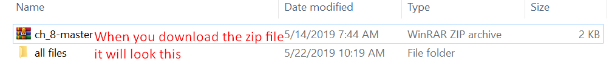
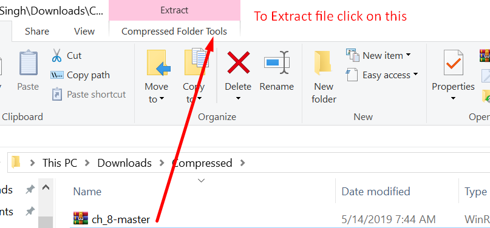
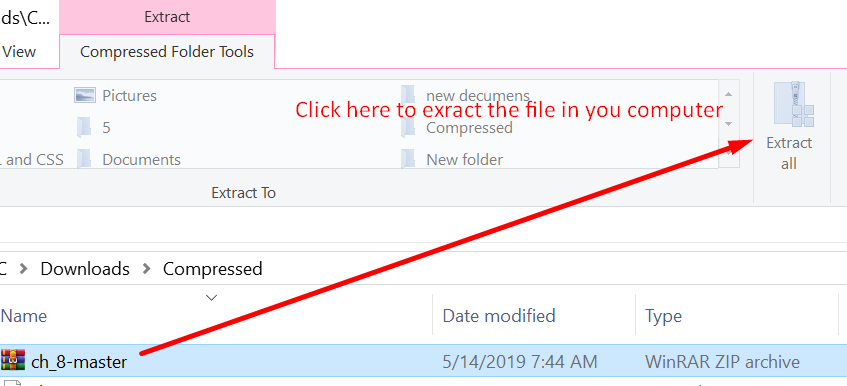

# First project from front half web devlopment with html forms

* Download the file in the zip format

## This is how you unzip the file:

### 

### 

### 

* Run this file in any editor like sublime text or visual code
 
* This chapter is about css flote and likes designe and mainly about this layout of the like &copy;
(https://book.airindia.in/itd/itd/lang/en/travel/quotes?journeyCount=1&search=SMART&calendarDate0=2019-07-17&calendarWindow=P3D&departDate0=2019-07-17&departLocation0=Airport.DEL&arriveLocation0=Airport.SFO&numInfants=0&numAdults=1&numChildren=0&fareClass=Economy&concessionaryTravellers=false&step=Search)
